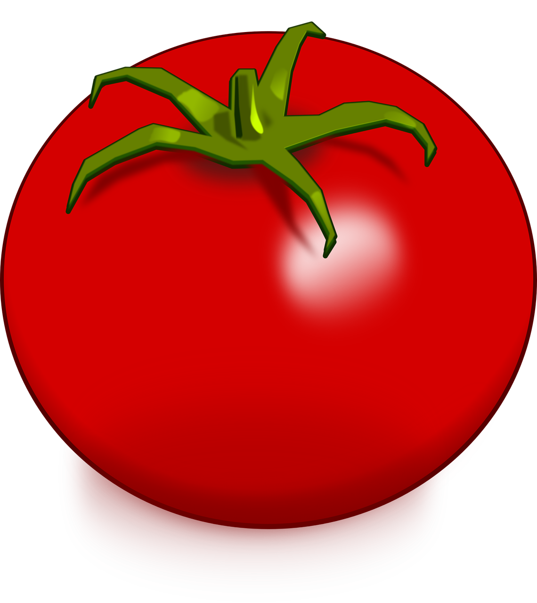

  

<h3 align="center">The Marvellous Tomato Counter</h3>

[GIVE IT A TRY!]

<!-- TABLE OF CONTENTS -->

  
Table of Contents

  <ol>
    <li>
      <a href="#about-the-project">About The Project</a>
      <ul>
      <li><a href="#what-is-the-deal-with-a-tomato-counter">What's the deal with a tomato counter?</a></li>
      </ul>
    </li>
    <li>
      <a href="#functionalities">Functionalities</a>
      <ul>
        <li><a href="#built-with">Built With</a></li>
      </ul>
    </li>
    <li><a href="#future-improvements">Future improvements</a>
    <ul><li><a href="#contributing">Contributing</a></li></ul>
    </li>
    <li><a href="#contacts">Contacts</a></li>
    <li><a href="#acknowledgments">Acknowledgments</a></li>
  </ol>

<!-- ABOUT THE PROJECT -->
## About The Project
This project is the final assignement of the JavaScript Basic course of [Start To Impact University]. The task was simple: build a counter with javascript.

Few requirements:
* Just JavaScript allowed, not Jquery neither frameworks (React, Angular, Vue...);
* The +/- buttons and the counter value have to be implemented through JavaScript.

Any add ons functionality welcomed!

(<a href="#readme-top">back to top</a>)

### What's the deal with a tomato counter?

The idea is to support anyone who might use *[the pomodoro tecnique]* to focus. This tecnique is a way to improve the ability to focus on a task, by drawing a tomato every 25 minutes of work. \
But what if I don't have paper or a pen? Here it comes *The marvellous tomato counter*, that draws the tomatoes for you!\
You can use it to keep track of how long you focused on a work you want(or must) do.

## Functionalities
With the Marvellous Tomato Counter you can:
* Simply keep count of your tomatoes manually with the counter, adding tomatoes to the screen;
* Set a number of tomatoes to start with, then add more with the counter;
* Set up a stopwatch that every 25 minutes add a tomato for you*. \
*\* For debugging reasons the stowatch function right now is set to add a tomato every second.*

### Built With

\
\

(<a href="#readme-top">back to top</a>)

<!-- GETTING STARTED -->
## Future improvements
* Add an animation when a tomato is added;
* Add a sound everytime a tomato is added using the stopwatch: this way you do not need to switch to the tomato counter tab to see how much time has passed;
* Add a "save your progress" functionality, allowing to know how much time you are investing on a single task;
* Add to the stopwatch the possibility to toggle "break time!" which will make a sound when 25 minutes has passed, pause the stopwatch, and make another sound when 5 minutes has passed and it's time to go back to work.

... Anything you think could be useful! Feel free to contribute.

### Contributing

If you have a suggestion that would make this project more useful than it is or if you want to work on the improvements listed above, please do it!
Fork the repo and create a pull request, or open an issue with the tag enhancement.
1. Fork the Project
2. Create your Feature Branch (`git checkout -b feature/MarvellousFeature`)
3. Commit your Changes (`git commit -m 'Added a MarvellousFeature'`)
4. Push the Branch (`git push origin feature/MarvellousFeature`)
5. Open a Pull Request

## Contacts

Feel free to reach me if you have any advice or you want to collaborate!

[][linkedinUrl]

(<a href="#readme-top">back to top</a>)

<!-- ACKNOWLEDGMENTS -->
## Acknowledgments

* Tomato Picture by [CleanPNG][tomatoPictureUrl]
* Icons by [icons8][icons8Url]

(<a href="#readme-top">back to top</a>)

<!-- MARKDOWN LINKS -->
[GIVE IT A TRY!]: https://dalfabbio.github.io/tomatoCounter/
[Start To Impact University]: https://www.start2impact.it/
[the pomodoro tecnique]: https://todoist.com/it/productivity-methods/pomodoro-technique
[linkedinUrl]: https://www.linkedin.com/in/alessandro-fabbian-2a8261101/
[tomatoPictureurl]: https://www.cleanpng.com/png-tomato-drawing-vegetable-clip-art-tomato-640540/download-png.html
[icons8Url]: https://icons8.com/